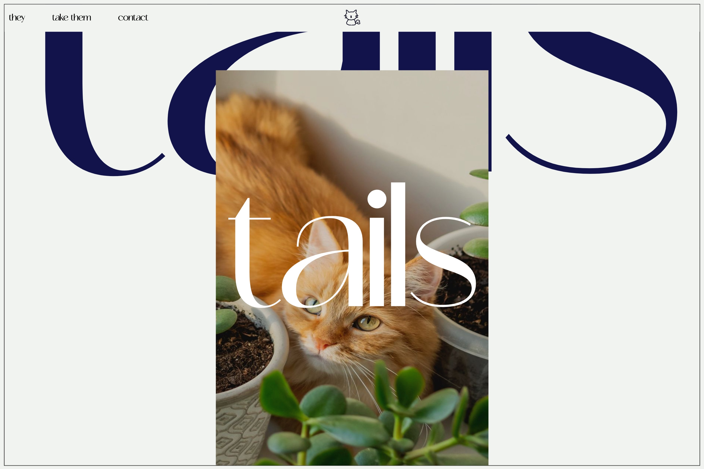

# Tails-web



Tails is a fictional website intended to display information about cats. It is a project that I had to complete for a subject in my degree program.

You can read the [report](./informe.pdf) I have written, which describes perfectly how I created the website and the technologies I used. Moreover, the code is commented to ensure it can be understood perfectly.

# Try it

To test the website, it is necessary to have the latest version of Chrome or Brave installed; currently, any browser with a Chromium version equal to or higher than v123 is required. This is because certain styles are used that do not display well in earlier versions.

It's also necessary to test it on a server. The easiest way to do this is by executing the following command in a terminal, at the root directory of the project, in `./tails`:

```shell
python3 -m http.server
```

Then, open the browser and go to `http://localhost:8000`. The website should be displayed correctly.

# Note

If you cannot see the report in the browser, you can download it and open it with a PDF reader. It is 20.2 MB.

